  

  

I build systems that orchestrate language models: routing across providers, automatic
fallback, and agents that decompose work.

I came from physics — undergraduate research in cosmology — and brought the habit of
measuring before claiming. That is why almost everything here ships with a test suite and
a number instead of an adjective.

## What the code proves

  

Generated by <a href="./.github/workflows/metrics.yml">a GitHub Action</a> that counts files in these repositories. No third-party service — every bar is a number you can verify by clicking the repo.

## Projects

**LLM orchestration**

- [model-chain-proxy](https://github.com/asm444/model-chain-proxy) — OpenAI-compatible HTTP
  proxy that chains 7 providers (OpenAI, Anthropic, Gemini, Mistral, xAI, Ollama,
  OpenRouter), falling through to the next on 5xx, 429 or timeout. Zero npm dependencies,
  SSE streaming, `/health` and Prometheus-format `/metrics`. JavaScript, Node 18+.
- [maestro](https://github.com/asm444/maestro) — multi-agent system that splits a goal into
  tickets and dispatches them to 7 department agents, with a QA verification pass at the
  end. TypeScript, tests on Node's native runner, no runtime dependencies.
- [BestModel.ai](https://github.com/asm444/BestModel.ai) — ranks OpenRouter models by actual
  quality against LMArena Elo scores, in S/A/B tiers. Plain Python.

**Scientific computing**

- [Algebrow](https://github.com/asm444/Algebrow) — computer algebra system written from
  scratch, with step-by-step solutions and LaTeX generation. 21 test modules covering
  calculus, ODEs, PDEs, series, tensors, groups, differential geometry and Fourier
  analysis. Python engine, FastAPI backend, React frontend.

**Automation and integration**

- [WhatsHeelper](https://github.com/asm444/WhatsHeelper) — WhatsApp support with AI triage
  and SLA-bound escalation to a human. 7 services orchestrated via Docker Compose
  (PostgreSQL 16, n8n, WAHA, business-engine, chat-simulator, dashboard-api,
  agent-dashboard), npm workspaces, unit/integration/e2e tests.
- [down-news](https://github.com/asm444/down-news) — watches 11 services (Claude, ChatGPT,
  Gemini, AWS, Azure, Cloudflare and others) every 5 minutes and alerts on Discord.
  Serverless in the literal sense: the only infrastructure is a GitHub Actions cron.
- [telinha](https://github.com/asm444/smartClaude) — client, daemon and build pipeline for
  the 240x240 IPS display embedded in the chassis of a Positivo Vision R15M laptop. Python
  and Pillow, custom transport protocol, hardware tests isolated behind a pytest marker.

**Applied security**

- [weather-cli](https://github.com/asm444/weather-cli) — weather in the terminal, with a
  local cache encrypted using Fernet (AES-128-CBC + HMAC-SHA256) derived via PBKDF2,
  atomic writes, 0600/0700 permissions and symlink protection through `O_NOFOLLOW` +
  `lstat()`.

Pulling that last thread: my next project is security tooling, applying the agent
orchestration above to reconnaissance and analysis.

## Stack

Every entry links to the code that proves it.

| | |
|---|---|
| Python | [Algebrow](https://github.com/asm444/Algebrow), [telinha](https://github.com/asm444/smartClaude), [down-news](https://github.com/asm444/down-news), [weather-cli](https://github.com/asm444/weather-cli) |
| JavaScript / Node | [model-chain-proxy](https://github.com/asm444/model-chain-proxy) |
| TypeScript | [maestro](https://github.com/asm444/maestro), [WhatsHeelper](https://github.com/asm444/WhatsHeelper) |
| FastAPI + React | [Algebrow](https://github.com/asm444/Algebrow) |
| PostgreSQL + Docker | [WhatsHeelper](https://github.com/asm444/WhatsHeelper) |
| LLM APIs | [model-chain-proxy](https://github.com/asm444/model-chain-proxy), [maestro](https://github.com/asm444/maestro), [BestModel.ai](https://github.com/asm444/BestModel.ai) |
| LaTeX / Jupyter | [Algebrow](https://github.com/asm444/Algebrow), [Python na Prática](https://github.com/asm444/Python-na-Pratica-Fisica-e-Afins) |

## Also

I taught the short course [Python na Prática: Física e Afins](https://github.com/asm444/Python-na-Pratica-Fisica-e-Afins)
at the XXVI Semana da Física. The material is still open.

## Contact

[LinkedIn](https://www.linkedin.com/in/arthur-de-souza-molina/) ·
[arthur.souza.molina@gmail.com](mailto:arthur.souza.molina@gmail.com)
